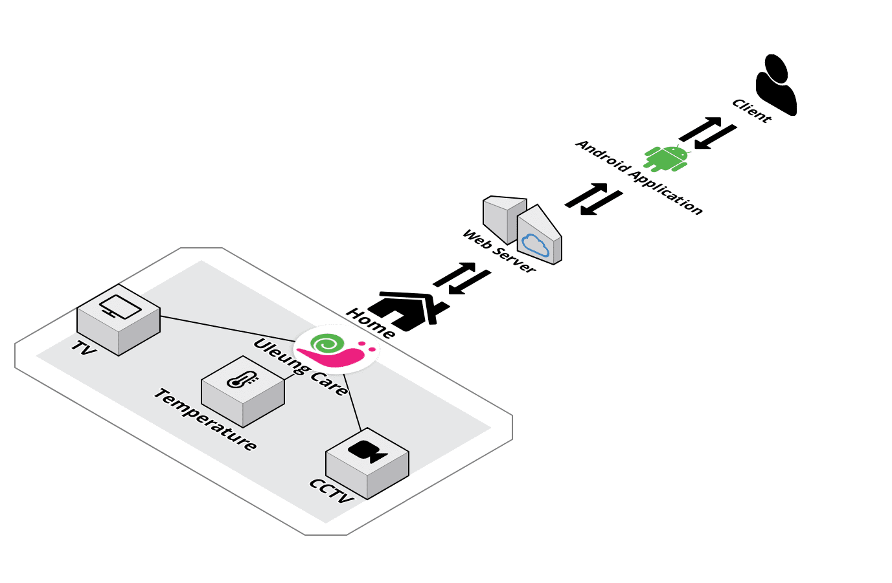
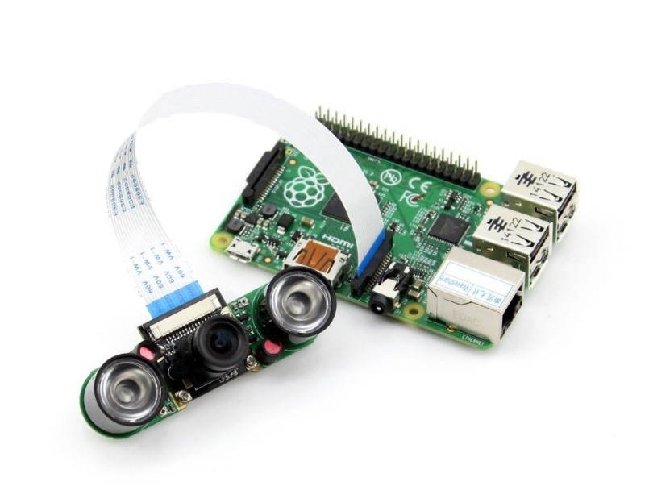
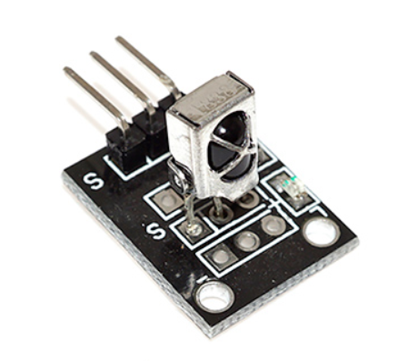
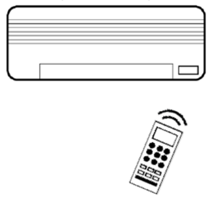
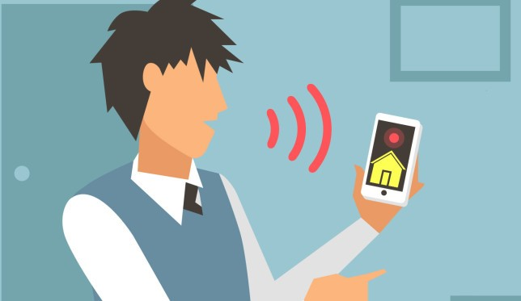
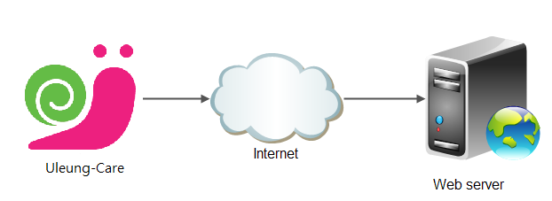
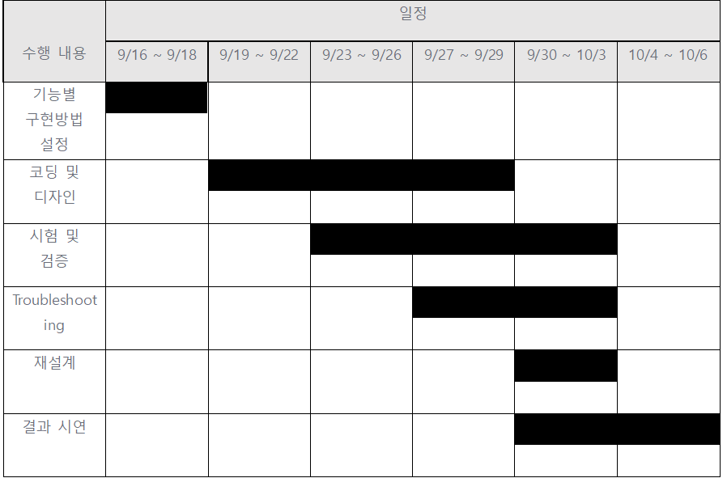

  

# 1. 개발배경 및 목적  
교내 프로젝트 중 라즈베리파이를 활용한 프로젝트를 진행한다. 이에 2019 공개 SW 개발자대회와 병행하여 지원금을 늘리고 제품의 질을 높이기 위하여 이 프로젝트를 진행한다. 
IoT 제품이 증가하는 요즘 저렴한 가격으로 높은 효율을 가진 IoT 제품을 제작하기 위해 라즈베리파이를 활용하여 홈 케어 디바이스를 개발한다. 

# 2. 개발 환경 및 개발언어  
라즈베리파이를 베이스로 IoT 홈 케어 디바이스를 제작할 것이다. 카메라 모듈, 온습도 센서, 적외선 리모콘 모듈, 서보 모터 등등 홈 케어 기능에 필요한 장비들을 사용할 것이며 필요시 아두이노를 추가로 사용할 것이다.
센서와 모듈은 C언어로 조작 및 데이터를 받고 사용자는 Python기반의 Web Server와 통신하여 디바이스를 컨트롤하고 데이터나 카메라 화면을 확인할 것이며 JAVA로 제작한 Android Application으로도 디바이스를 조작하고 데이터를 확인할 수 있는 환경을 구성해준다.  

# 3. 시스템 구성 및 아키텍쳐  

  

**구조도 예시**

집 내부에 배치된 Uleng Care가 TV를 제어하거나 온도를 조절하는 등 홈 케어 서비스를 해주며 CCTV 화면을 Web Server를 통해 Client에게 전송하고 Client는 Android Application으로 집안 상황을 살피거나 여러 기기들을 제어할 수 있다.  

# 4. 주요기능  

## 홈 CCTV  

**focusable 5mp 적외선 야간 투시경 1080 p 라즈베리 파이 카메라 모듈**

적외선 야간 투시경 카메라를 이용하여 사용자가 집을 비울 때 집 안을 확인할 수 있고 반려동물과 함께 생활한다면 집을 장시간 비울 때 반려동물의 상태를 확인할 수 있다.
적외선 야간 투시경을 사용하였으므로 야간에도 사용 가능하다.  

## 적외선 리모컨 제어  
  

**적외선 IR센서 수신모듈**

 

**에어컨 제어 예상도**

집에서 적외선 리모콘으로 조작하는 기기인 에어컨과 TV를 하나의 리모컨으로 통합하고 제어할 수 있으며 온 습도 센서의 값을 받아서 에어컨을 자동으로 제어할 수 있다.
그 외 다른 적외선 리모콘을 사용하는 모든 기기들은 모두 제어 가능하다.  

## 음성제어  

  

**음성 제어 예상도**

음성 인식 API를 활용하여 디바이스의 모든 기능을 음성 제어 가능하며 Android Application에서도 음성 제어를 가능하게 한다.  

## Web Server 제어  

  

**Web Server 제어 예상도**

기존 IoT 기기들처럼 Web Server를 통해 사용자가 디바이스를 제어할 수 있다. 집 안에서 뿐만 아니라 외출시에도 Web Server를 통해 디바이스를 제어하거나 집안 온도, CCTV 화면 등 여러가지를 확인 가능하며 Android Application 또한 Web Server를 통해 디바이스와 통신한다.  

# 5. 프로젝트 추진일정  

  

# 6. 기대효과 및 활용분야  
이번 프로젝트가 활용되어 상품화된다면 스마트 스피커 같은 타 IoT 기기들보다 저렴한 가격에 공급이 가능하다. 또한 기존에 사용하던 적외선 리모컨으로 조작하는 기기들도(ex: TV 에어컨, 보일러) IoT 기기처럼 사용 가능하므로 경제적 부담으로 인해 IoT 환경을 구성하지 못하던 저소득층이나 적은 돈으로 IoT 환경을 구성하고 싶어하던 사용자들도 사용 가능하다.
적외선 CCTV를 장착하여 집 밖에서도 집안 상황을 확인할 수 있기 때문에 방범 문제로 고민하는 사람이나 반려동물을 오랫동안 집 안에 혼자 둬야하는 사람들이 유용하게 사용할 수 있다. 
Wi-Fi 환경이 구성되어 있다면 어디서든지 사용 가능하기 때문에 집 이외에도 매장 내부에서도 활용할 수 있다.

